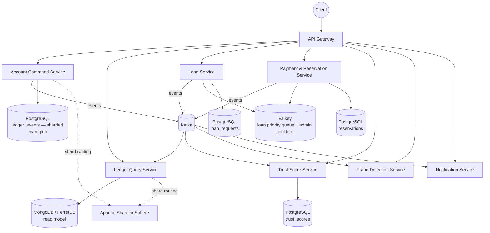
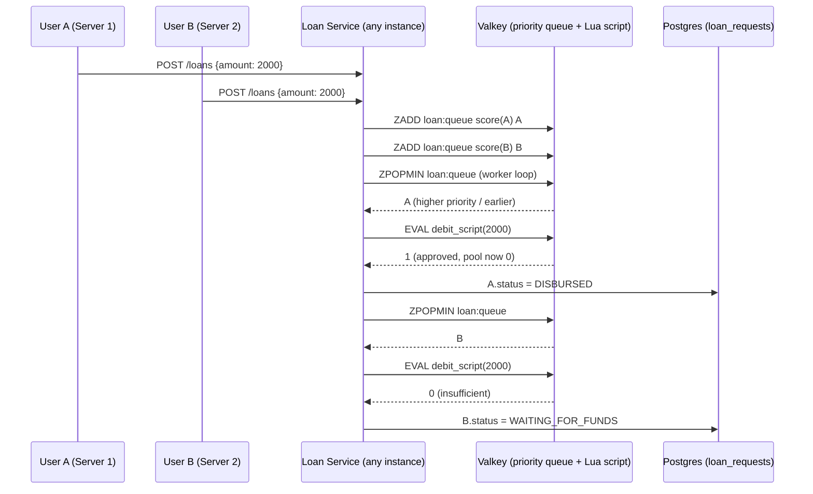
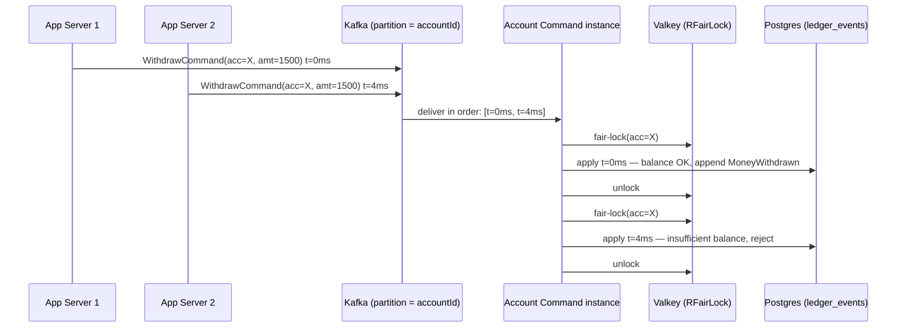
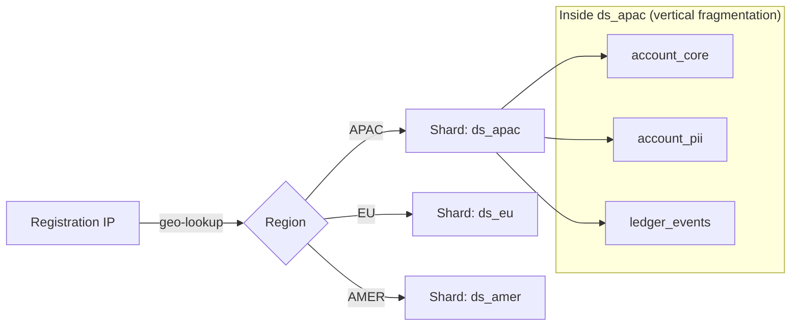

# Event-Sourced Banking Ledger — v2 HLD, LLD & System Design
### Distributed Systems + DDBS Edition

This version replaces the earlier design. The center of gravity has moved from "CQRS demo app" to **concrete distributed-systems and distributed-database mechanisms you can point at and prove**: a contended-resource task queue, offline-capable payments, cross-server concurrency control, and hybrid data fragmentation.

---

## 0. Open-source tools & libraries selected

Every non-trivial mechanism below is backed by a real open-source library, chosen deliberately and checked for license fitness (a couple of popular choices relicensed away from permissive open source recently — noted where relevant).

| Concern | Tool | License | Why this one |
|---|---|---|---|
| Distributed locks, fair (FCFS) locking, priority queues | **Redisson** (Java client) | Apache 2.0 | `RFairLock` gives true first-come-first-served lock acquisition (not just "a lock" — a *fair* one, which is exactly requirement 3). `RScoredSortedSet` gives an O(log n) priority queue for the loan system. |
| In-memory store backing Redisson | **Valkey** (Linux Foundation fork of Redis 7.2) | BSD-3-Clause | Redis Inc. moved Redis itself to SSPL/RSAL/AGPL licensing in 2024–2025 (source-available, not OSI open source). Valkey is the community fork that stayed BSD, is wire-protocol compatible, and needs zero code changes in Redisson. Use Valkey, not Redis, as the actual running server. |
| Alternative/complementary task queue | **RabbitMQ** (native priority queues via `x-max-priority`) | MPL 2.0 | Worth documenting as the "dedicated broker" alternative to a Redis-based queue if the team prefers a classic AMQP work queue for the loan/withdrawal task queues. |
| Event streaming | **Apache Kafka** | Apache 2.0 | Unchanged from v1 — partition-per-account ordering, replayable log. |
| Event store / relational data | **PostgreSQL** | PostgreSQL License (permissive) | Unchanged. |
| Database sharding middleware | **Apache ShardingSphere** (ShardingSphere-JDBC) | Apache 2.0 | Implements the horizontal fragmentation requirement as a JDBC-layer library — no separate proxy process needed, application code queries logical tables and ShardingSphere routes to the correct physical shard. |
| Read-model document store | **MongoDB Community Edition** | SSPL (⚠️ also not OSI-approved, same category of issue as old Redis) | Flagging this honestly: if a fully-open-source stack matters for grading, swap to **FerretDB** (Apache 2.0, MongoDB-wire-compatible, stores data in PostgreSQL underneath) or just use PostgreSQL `JSONB` columns for the read model instead of a second DB engine. Document whichever the team picks as an ADR. |
| IP → region lookup (for fragmentation) | **ip-location-db** project (GitHub: `sapics/ip-location-db`) | PDDL (public-domain-equivalent) | MaxMind GeoLite2 now requires an account + its own EULA to even download the free tier. `ip-location-db` ships ready-to-use CSV/MMDB country files with no signup, which is simpler and cleaner for a course project. |
| Offline payment token signing | **Nimbus JOSE + JWT** | Apache 2.0 | Signs/verifies offline payment tokens asymmetrically, so a merchant-side device can verify a token's authenticity without a network call. |
| Service discovery, gateway, config | **Eureka, Spring Cloud Gateway, Spring Cloud Config** | Apache 2.0 | Unchanged from v1. |
| Resilience | **Resilience4j** | Apache 2.0 | Unchanged from v1. |
| Testing | **JUnit5, Testcontainers** (now also spinning up Valkey + a second Postgres shard in CI) | EPL/MIT | Unchanged, extended. |

---

## 1. What's actually new vs. v1 (map to your 6 requirements)

| # | Your requirement | Mechanism used | Section |
|---|---|---|---|
| 1 | Loan system, pool contention, FCFS + trust score | Redisson priority queue (`RScoredSortedSet`) + atomic pool debit via Lua script | §3 |
| 2 | Internet pay + offline pay via temp reservation | New `FundsReserved`/`FundsCaptured`/`FundsReleased` events + signed offline token | §4 |
| 3 | Multi-server concurrent withdrawal, task queue, FCFS | Kafka partition-per-account + Redisson `RFairLock` | §5 |
| 4 | Basic concurrency verification | Optimistic concurrency (v1, retained) + idempotency keys | §6 |
| 5 | Hybrid vertical + horizontal fragmentation by IP | Apache ShardingSphere region-based horizontal sharding + column-split vertical fragmentation | §7 |
| 6 | Open-source tooling | §0 above | §0 |

---

## 2. Updated service topology



8 services total (well above the 5-service minimum): API Gateway, Account Command, Ledger Query, Loan Service, Payment & Reservation Service, Trust Score Service, Fraud Detection, Notification. `Apache ShardingSphere` is a library embedded in Account Command and Ledger Query's JDBC layer, not a standalone service. `Valkey` is shared infrastructure, not a business service.

---

## 3. Requirement 1 — Loan system: pool contention, task queue, FCFS + trust score

### 3.1 The problem, stated precisely
The bank admin pool has ₹2,000 available. Two users each request a ₹2,000 loan at nearly the same instant, from possibly different Loan Service instances. Exactly one must succeed; the other must be queued or rejected — never both approved (that would overdraw the pool), and never silently dropped.

### 3.2 Data model
```sql
-- Owned by Loan Service
CREATE TABLE admin_pool (
  pool_id UUID PRIMARY KEY,
  available_balance NUMERIC(18,2) NOT NULL,
  version INT NOT NULL                    -- optimistic concurrency, mirrors event-store pattern
);

CREATE TABLE loan_requests (
  loan_id       UUID PRIMARY KEY,
  account_id    UUID NOT NULL,
  amount        NUMERIC(18,2) NOT NULL,
  trust_tier    SMALLINT NOT NULL,        -- 0=Low .. 3=Excellent, snapshotted at request time
  requested_at  TIMESTAMPTZ NOT NULL DEFAULT now(),
  status        VARCHAR(20) NOT NULL      -- QUEUED, WAITING_FOR_FUNDS, APPROVED, DISBURSED, REJECTED
);
```

### 3.3 Priority queue design
Every loan request is pushed onto a Redisson `RScoredSortedSet` ("loan:queue") with a composite score that encodes **trust tier first, arrival time second** — higher trust tier is served first, and within the same tier, earlier requests win (true FCFS):

```
score = (3 - trustTier) * 10_000_000_000L + requestedAtEpochMillis
```
Lower score = popped first. A tier-3 (Excellent) request submitted later will always beat a tier-0 (Low) request submitted earlier, but two tier-2 requests are strictly ordered by timestamp — this is the "sorting technique with FCFS and trust score both used" from your requirement.

### 3.4 Atomic pop-and-debit (the actual concurrency fix)
The failure mode you described — two servers both reading "₹2,000 available" and both approving — happens when the *read* of pool balance and the *debit* are two separate steps. The fix is to make them one atomic operation, run as a Redis/Valkey **Lua script** (Redis scripts execute atomically, single-threaded, so no other client can interleave):

```lua
-- KEYS[1] = admin_pool:balance, ARGV[1] = requested amount
local bal = tonumber(redis.call('GET', KEYS[1]))
if bal >= tonumber(ARGV[1]) then
  redis.call('DECRBY', KEYS[1], ARGV[1])
  return 1   -- approved
else
  return 0   -- insufficient funds right now
end
```
A single Loan Service worker (any instance — they're stateless and interchangeable) pops the queue head, runs this script, and:
- **Success (1):** writes `LoanApproved` → `LoanDisbursed` events, updates Postgres `loan_requests.status = DISBURSED`.
- **Failure (0):** the request moves to `status = WAITING_FOR_FUNDS` and stays out of the active queue until an `AdminPoolReplenished` event (e.g., another loan gets repaid, or the admin deposits more) triggers a re-check of the waiting list, highest-priority first.

This is exactly your ₹2,000-pool, two-₹2,000-requests scenario: the first request to reach the front of the queue (by tier, then FCFS) gets the money; the second is queued as `WAITING_FOR_FUNDS`, not rejected outright and not double-approved.

### 3.5 Sequence



### 3.6 Trust score
Owned by **Trust Score Service**, which consumes `account.events` and `loan.events` and maintains a running score (0–100) per account:

| Event | Effect |
|---|---|
| `MoneyDeposited` | +0.5 per ₹10,000 deposited (capped +5/day) |
| `LoanRepaidOnTime` | +10 |
| `LoanRepaidEarly` | +15 |
| `LoanTaken` (disbursed) | −5 (recovered on repayment) |
| `LoanRepaidLate` | −8 |
| `LoanDefaulted` | −20 |

Tiers: 0–40 Low, 41–70 Medium, 71–90 High, 91–100 Excellent. Trust Score Service publishes `TrustScoreChanged`, which Loan Service consumes to keep a **local read-only cache** of each account's current tier — so a loan request doesn't need a synchronous cross-service call to price its priority; it reads its own local, eventually-consistent copy. This is CQRS applied again, one level down: Loan Service is the "query side" for trust data it doesn't own.

---

## 4. Requirement 2 — Internet pay and offline pay via reservation

### 4.1 Online payment (the easy path)
Standard synchronous flow: Payment & Reservation Service calls Account Command Service, which validates and appends `MoneyWithdrawn`/`MoneyDeposited` as in v1. No new mechanism needed.

### 4.2 Offline payment (the interesting path)
The core problem: a customer about to lose connectivity (e.g., paying a vendor with no network) still needs to guarantee funds are spendable, without the bank being reachable to authorize the transaction in real time. The fix is a **pessimistic pre-commit reservation**, made *before* going offline, deliberately trading off the "optimistic, append-and-reconcile" style used everywhere else in this system, because an offline client cannot participate in a later compensation if something goes wrong.

**New events:** `FundsReserved`, `FundsCaptured`, `FundsReleased`.

**Flow while still online:**
1. `POST /reservations {accountId, amount, ttlMinutes}` → Payment & Reservation Service asks Account Command Service to move `amount` from `available_balance` to `reserved_balance` (both are derived read-model fields; the write is a normal event, `FundsReserved`, with optimistic concurrency exactly like v1).
2. Service mints a **signed offline token** (Nimbus JOSE+JWT, asymmetric signing) containing `{reservationId, accountId, amount, expiresAt}`. The private key lives only on the bank's servers; a merchant device only needs the public key to verify the token's authenticity and expiry — entirely offline, no network call.
3. Token is handed to the customer's device (e.g., as a QR code).

**Redemption (merchant scans the token, possibly still offline):**
4. Merchant device verifies the signature + expiry locally — this is the part that works with zero connectivity.
5. When the merchant's device regains connectivity (could be minutes or hours later), it calls `POST /reservations/{id}/capture`. The service checks a `redeemed` idempotency table keyed by `reservationId` — first capture wins, any replay of the same token is rejected, preventing the classic offline-payment double-spend (someone showing the same QR code to two different merchants).
6. On successful capture: `FundsCaptured` event finalizes the transfer to the merchant's account; the temporary hold is converted into a real debit.
7. **Expiry path:** a scheduled job releases any reservation whose TTL passed uninvoked, publishing `FundsReleased`, returning the hold to `available_balance`.

### 4.3 Data model
```sql
CREATE TABLE reservations (
  reservation_id UUID PRIMARY KEY,
  account_id     UUID NOT NULL,
  amount         NUMERIC(18,2) NOT NULL,
  status         VARCHAR(20) NOT NULL,   -- RESERVED, CAPTURED, RELEASED, EXPIRED
  expires_at     TIMESTAMPTZ NOT NULL,
  captured_at    TIMESTAMPTZ
);
CREATE UNIQUE INDEX idx_reservation_capture ON reservations (reservation_id) WHERE status = 'CAPTURED';
```

### 4.4 Why this is worth explaining in a viva
Everywhere else in this system, consistency is achieved optimistically (append the event, reconcile later, compensate on failure — the saga pattern). The offline-payment path is the one place that *cannot* use that approach, because a disconnected client has no way to be told "actually that failed, please compensate." So it deliberately uses the opposite strategy: reserve pessimistically, guarantee the funds *before* the risk window starts, and only finalize afterward. Being able to say "here's where we chose optimistic concurrency, and here's the one place we chose pessimistic reservation, and here's why" is a strong distributed-systems answer.

---

## 5. Requirement 3 — Multi-server concurrent withdrawal, task queue, FCFS

### 5.1 The problem
The same user issues two withdrawal requests near-simultaneously, and load balancing sends them to two different Account Command Service instances. Both must not succeed if the balance only covers one.

### 5.2 Two layers of defense

**Layer 1 — ordering at the queue, not the app server.** Withdrawal *commands* (not raw HTTP requests) are published to Kafka's `account.events` topic (or a dedicated `account.commands` topic) keyed by `accountId`. Kafka guarantees only one partition holds all messages for a given key, and only one consumer instance processes a given partition at a time — so no matter which of the two app server instances *received* the HTTP request, both commands land in the same partition, in the order the broker received them. FCFS ordering happens at the broker, not by trusting whichever app server happened to run first.

**Layer 2 — a fair lock around the actual debit.** The consuming instance that processes the partition still needs to check-and-update the balance safely if it's handling many accounts concurrently on multiple threads. It acquires a Redisson `RFairLock` scoped to that `accountId` before reading the current version/balance and writing the new event:
```java
RLock lock = redisson.getFairLock("account-lock:" + accountId);
lock.lock(5, TimeUnit.SECONDS);   // fair: waiters queue strictly in arrival order
try {
    // read current version, validate balance, append event
} finally {
    lock.unlock();
}
```
Redisson's `FairLock` specifically avoids the "barging" problem of a plain lock, where a thread that arrives later can sometimes acquire the lock before one that's been waiting longer — which matters here because "first come, first served" is a stated requirement, not just "eventually consistent."

### 5.3 Sequence



---

## 6. Requirement 4 — Basic concurrency & correctness "hygiene"

These are the table-stakes mechanisms every real bank system needs, layered under everything above:

- **Optimistic concurrency on the event store** (from v1, retained): `UNIQUE(aggregate_id, version)` in Postgres — still the ultimate source-of-truth guard even with the queue/lock layers above; those layers reduce *contention*, this constraint guarantees *correctness* even if they somehow failed.
- **Idempotency keys on every state-changing API call:** clients send an `Idempotency-Key` header; the server persists it in a `processed_requests(key, response_snapshot, expires_at)` table for 24h. A retried double-click or a client-side retry-after-timeout replays the same key and gets back the original result instead of double-processing.
- **Client-side debounce:** disable the submit button after first click (basic UX hygiene, not a substitute for the server-side guarantee above, but expected of a real banking UI).

---

## 7. Requirement 5 — Hybrid horizontal + vertical fragmentation by user IP

### 7.1 Horizontal fragmentation (row-splitting, by region)
At account-open time, the customer's registration IP is resolved to a region using the **ip-location-db** dataset (offline CSV/MMDB lookup, no external call at request time). The resolved `region` (e.g., `APAC`, `EU`, `AMER`) is stored on the account and used as the **sharding key**.

Apache ShardingSphere-JDBC is configured with an inline sharding algorithm:
```yaml
rules:
  - !SHARDING
    tables:
      ledger_events:
        actualDataNodes: ds_${region}.ledger_events
        databaseStrategy:
          standard:
            shardingColumn: region
            shardingAlgorithmName: region-inline
    shardingAlgorithms:
      region-inline:
        type: INLINE
        props:
          algorithm-expression: ds_${region}
```
Application code still writes `INSERT INTO ledger_events ...` against a *logical* table; ShardingSphere transparently routes each row to `ds_apac`, `ds_eu`, or `ds_amer` — this transparency (app code doesn't know or care which physical database it hit) is itself a core DDBS concept worth naming explicitly: **fragmentation transparency**.

### 7.2 Vertical fragmentation (column-splitting, within each shard)
Within each regional shard, account data is further split by access pattern and sensitivity, rather than kept as one wide table:

| Fragment | Contents | Why split out |
|---|---|---|
| `account_core` | accountId, status, region, openedAt | Small, hot, read on almost every request |
| `account_pii` | holderName, KYC documents, registration IP, address | Sensitive, infrequently read, candidate for stricter access control/encryption at rest |
| `ledger_events` | the append-only event log itself | Extremely high write volume, never updated — benefits from being physically isolated from the slower-changing tables above so its I/O pattern doesn't contend with them |

### 7.3 Hybrid picture
A single customer's data is therefore: **horizontally** placed into one regional shard (say `ds_apac`) based on their registration IP, and **vertically** split within that shard across `account_core` / `account_pii` / `ledger_events`. This is the textbook definition of hybrid fragmentation — most student DDBS projects implement only one axis; implementing both, and being able to explain the *independent reasons* for each (region for data-locality/latency, sensitivity/access-pattern for column-splitting) is the differentiator.

### 7.4 Diagram



---

## 8. Non-functional summary (updated)

| Requirement | Mechanism |
|---|---|
| No double-approval of loans under contention | Atomic Lua-script pop-and-debit on Valkey |
| Fair ordering under load | Kafka partition-per-key + Redisson `RFairLock` |
| Payments survive total network loss | Pre-reserved, signed, offline-verifiable tokens |
| No double-spend of an offline token | Idempotent capture keyed by `reservationId` |
| Data locality / access-pattern optimization | Hybrid horizontal (region) + vertical (sensitivity) fragmentation via ShardingSphere |
| Open-source, license-clean stack | Valkey over Redis, ip-location-db over MaxMind, FerretDB/Postgres-JSONB flagged as the OSI-clean swap for MongoDB |

---

## 9. What to build first (suggested order)
1. Account Command + Ledger Query with the v1 event-sourcing core (foundation everything else sits on).
2. Trust Score Service (simple event consumer, needed before Loan Service can price anything).
3. Loan Service with the Valkey priority queue + Lua script (the centerpiece distributed-systems feature).
4. Redisson `RFairLock` retrofit onto the withdrawal path in Account Command Service.
5. Payment & Reservation Service (online path first, then offline token issuance/capture).
6. ShardingSphere region fragmentation (can be retrofitted onto Account Command/Ledger Query once the schema is stable — don't do this first, it complicates early debugging).
7. Fraud Detection + Notification (carried over from v1, lowest risk).