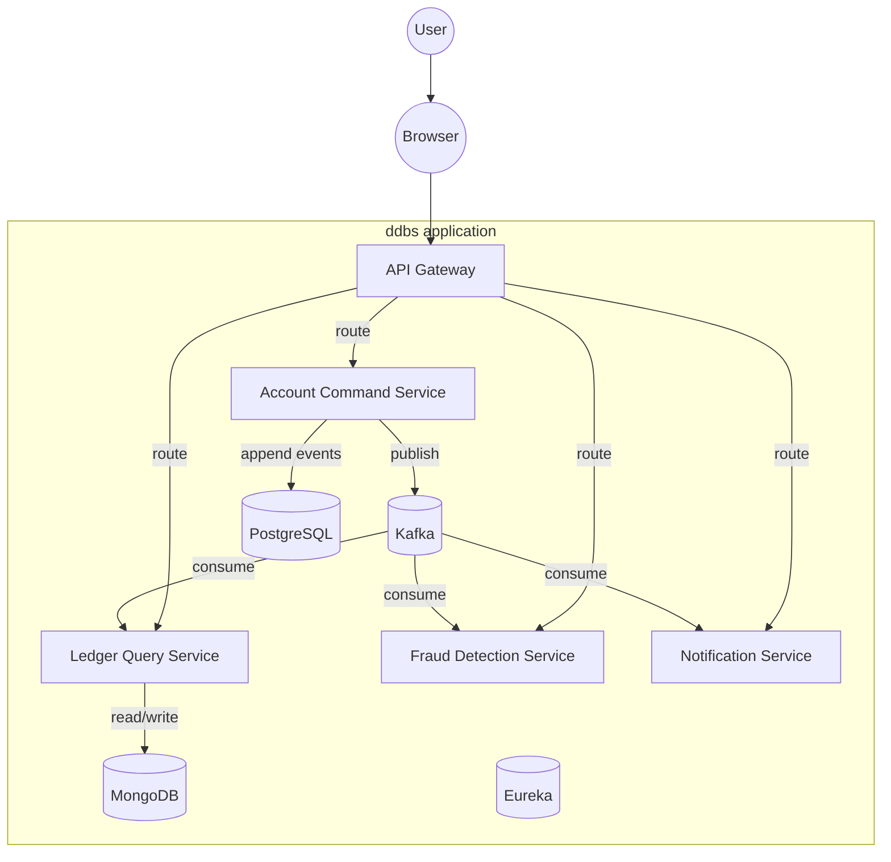

# Event-Sourced Banking Ledger with CQRS

> CS465 — Distributed Database Systems (Major Project)

| Team Member | Role |
|---|---|
| [Member A] | Account Command Service Lead |
| [Member B] | Ledger Query Service Lead |
| [Member C] | Fraud Detection Service Lead |
| [Member D] | Notification Service Lead |

---

## Summary

An event-sourced banking ledger with CQRS, Saga pattern for cross-service consistency, and a tamper-evident audit trail — all containerized with Docker Compose and documented for a university distributed database systems course.

---

## Architecture Diagram



Full diagram: `docs/ARCHITECTURE.md`

---

## Tech Stack

| Layer | Choice |
|---|---|
| Language | Java 17 |
| Build | Maven multi-module |
| Framework | Spring Boot 3.4.x |
| Cloud | Spring Cloud 2024.0.x |
| Discovery | Netflix Eureka |
| Gateway | Spring Cloud Gateway |
| Event Store | PostgreSQL `events` table |
| Read Model | MongoDB |
| Messaging | Apache Kafka |
| Frontend | React (Vite) + TypeScript |
| Containerization | Docker + Docker Compose |
| Testing | JUnit 5 + Mockito + Testcontainers |

Full table: `docs/ARCHITECTURE.md`

---

## Folder Structure

```
ddbs/
├── account-command-service/   # Command side (writes)
├── ledger-query-service/      # Query side (reads)
├── fraud-detection-service/   # Fraud rules + alerts
├── notification-service/      # Customer notifications
├── api-gateway/               # Single entry point
├── infra/                     # Dockerfiles, config repo
├── frontend/                  # React dashboard
├── docs/
│   ├── ARCHITECTURE.md        # High-level architecture + diagrams
│   ├── EVENT_CATALOG.md       # All domain events + schemas
│   ├── DATA_MODEL.md          # Per-service data ownership
│   ├── SAGA_DESIGN.md         # Transfer saga + state machine
│   ├── TESTING_STRATEGY.md    # Test pyramid + replay testing
│   ├── DEPLOYMENT.md          # Local + cloud deployment
│   ├── OPEN_SOURCE_STACK.md   # Libraries to reuse (with links)
│   ├── FEATURE_BENCHMARKING.md# Comparable projects + backlog
│   ├── SKILLS_PLAYBOOK.md     # Claude skills mapping
│   ├── OPEN_DECISIONS.md      # Pending team decisions
│   ├── api_spec/              # OpenAPI 3.0 YAML per service
│   ├── adr/                   # Architecture Decision Records
│   └── features/              # Feature epics (01-09)
├── docker-compose.yml         # Full stack dev environment
└── pom.xml                    # Parent Maven POM
```

---

## Quick Start

```bash
# 1. Clone
git clone <repo-url>
cd dbs

# 2. Start everything
docker-compose up --build -d

# 3. Verify services are healthy
curl http://localhost:8080/actuator/health
curl http://localhost:8081/actuator/health
curl http://localhost:8761  # Eureka dashboard

# 4. Hit the API
curl -X POST http://localhost:8080/api/accounts \
  -H "Content-Type: application/json" \
  -d '{"accountHolderName":"Alice","email":"alice@example.com","initialDeposit":1000}'

curl http://localhost:8080/api/accounts/<id>/balance
```

---

## Documentation Index

| Doc | What's In |
|---|---|
| `docs/ARCHITECTURE.md` | Architecture, C4 diagrams, service matrix |
| `docs/EVENT_CATALOG.md` | All domain events, payloads, versioning |
| `docs/DATA_MODEL.md` | Per-service ownership, read models, consistency |
| `docs/SAGA_DESIGN.md` | Transfer saga, state machine, compensating actions |
| `docs/TESTING_STRATEGY.md` | Test pyramid, event replay testing |
| `docs/DEPLOYMENT.md` | Local dev, cloud target, logging, observability |
| `docs/OPEN_SOURCE_STACK.md` | Libraries with links, licenses, recommendations |
| `docs/FEATURE_BENCHMARKING.md` | Comparable projects, backlog priorities |
| `docs/SKILLS_PLAYBOOK.md` | Claude skills mapping for future sessions |
| `docs/OPEN_DECISIONS.md` | Pending team decisions |
| `docs/api_spec/` | OpenAPI 3.0 YAML per service |
| `docs/adr/` | Architecture Decision Records |
| `docs/features/` | Feature epics with acceptance criteria |

---

## Project Status / Roadmap

- [ ] **Planning:** All docs written, team reviews open decisions
- [ ] **Sprint 1:** Scaffold services, infrastructure, event store schema
- [ ] **Sprint 2:** Account lifecycle + deposit/withdraw (Features 01-02)
- [ ] **Sprint 3:** Money transfer saga + fraud detection (Features 03-05)
- [ ] **Sprint 4:** Queries + notifications + event replay (Features 04, 06, 07)
- [ ] **Sprint 5:** Gateway + frontend + testing (Features 08-09)
- [ ] **Sprint 6:** Polish, docs, demo prep

---

## License

MIT — see `LICENSE`
