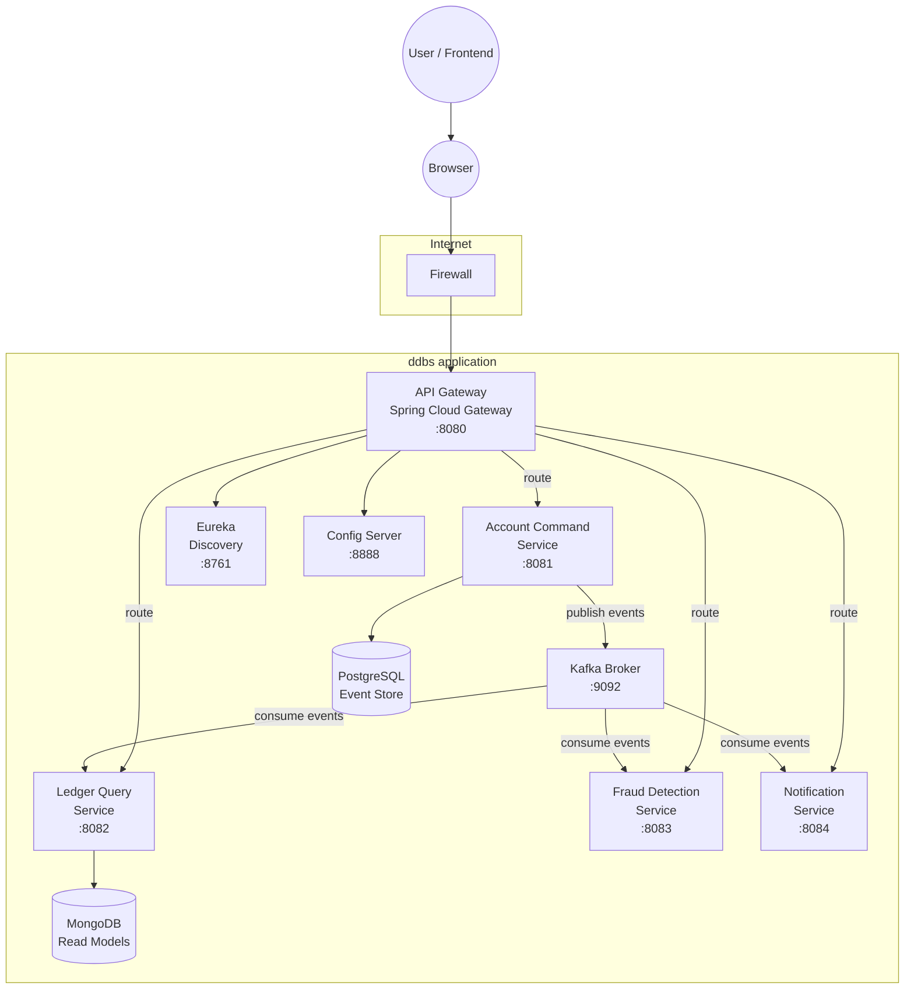
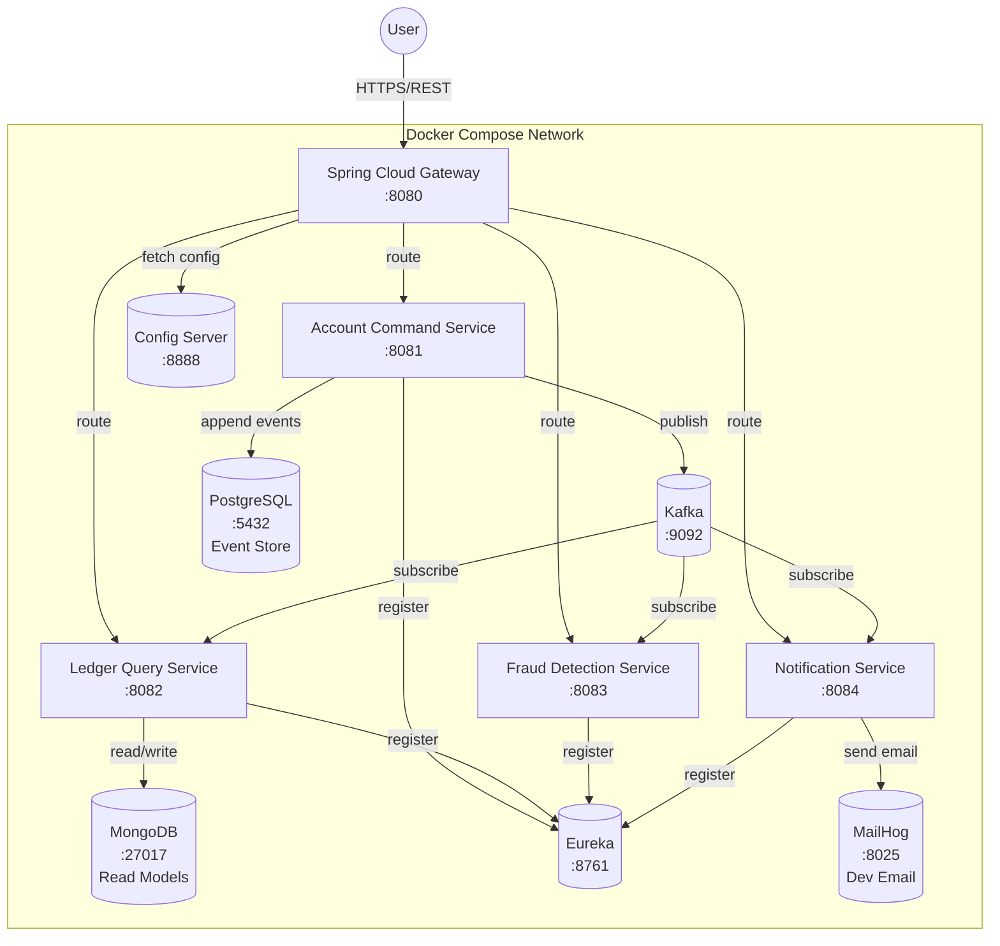

# Architecture — Event-Sourced Banking Ledger with CQRS

> Team project for CS465 — Distributed Database Systems

## Tech Stack

| Layer | Choice | Notes |
|---|---|---|
| Language | **Java 17 (LTS)** | Minimum LTS baseline for Spring Boot 3.x, Axon, Debezium compatibility |
| Build tool | **Maven** (multi-module reactor) | Standard in reference CQRS repos; team to confirm Gradle preference |
| Framework | **Spring Boot 3.4.x** | Deliberately not Boot 4.x — ecosystem validation trade-off |
| Cloud/distributed | **Spring Cloud 2024.0.x (Moorgate)** | Gateway, Config, Discovery |
| Service discovery | **Netflix Eureka** | Simple, well-documented |
| API Gateway | **Spring Cloud Gateway** | Reactive, first-party |
| Centralized config | **Spring Cloud Config Server** | Git-backed (folder in repo) |
| Event store | **PostgreSQL** `events` table (hand-rolled) | Team to confirm vs EventStoreDB — see ADR `docs/adr/0001-postgres-event-store.md` |
| Read-model store | **MongoDB** for Ledger Query; **PostgreSQL** for accounts/saga state | Polyglot persistence |
| Messaging | **Apache Kafka** | KRaft mode; matches CQRS bank demos |
| Saga | **Orchestration** inside Account Command Service | ADR `docs/adr/0003-orchestration-saga.md` |
| Frontend | **React (Vite) + TypeScript** | Team to confirm Angular preference |
| Containerization | **Docker + Docker Compose** | k8s stretch goal |
| Auth | **Spring Security + JWT** at Gateway; Keycloak stretch goal | |
| Testing | JUnit 5 + Mockito + Testcontainers + Spring Cloud Contract | |
| Observability | **Spring Boot Actuator + Micrometer** | Prometheus/Grafana stretch goal |
| CI | **GitHub Actions** | |
| Docs | **Markdown + Mermaid** | |

---

## System Context (C4 Level 1)

---

## Container View (C4 Level 2)

---

## Architectural Decisions & Rationale

### D1 — Sync vs Async communication
| Interaction | Pattern | Rationale |
|---|---|---|
| Client → API Gateway | Synchronous REST | Simple, request/response expected |
| Gateway → Command Service | Synchronous REST | Commands require immediate validation feedback |
| Gateway → Query Service | Synchronous REST | Read queries require fast response |
| Command Service → Event Store | Synchronous write | Atomic append needed for ordering |
| All service-to-service events | Async via Kafka | Decouples producers/consumers; enables replay |
| Saga steps | Async events + sync commands | Orchestrator calls commands synchronously per step, events async |

### D2 — Message Broker: Apache Kafka
- Chosen over RabbitMQ for: strong event ordering guarantees per partition, native replay, wide ecosystem (Debezium, Schema Registry).
- Trade-off: operational complexity of Kafka vs RabbitMQ simplicity.

### D3 — Event Store: PostgreSQL `events` table
- Hand-rolled append-only table chosen over EventStoreDB for: zero extra infrastructure, easier grading/demo, full control over schema.
- Trade-off: no built-in projections/subscriptions — consumer group semantics must be built in Kafka consumers. See ADR-0001.

### D4 — Saga Style: Orchestration
- Explicit orchestrator inside Account Command Service chosen over choreography for: clear step-by-step visibility, easier debugging, centralised compensating logic.
- Trade-off: orchestrator is a potential bottleneck/single point of failure (mitigated by idempotency + retries).

### D5 — API Gateway: Spring Cloud Gateway
- Chosen over Zuul (deprecated) for: reactive, first-party Spring project, native Eureka integration.

### D6 — Service Discovery: Netflix Eureka
- Simple, well-documented, standard in course Spring Cloud projects.

### D7 — Read Model Store: MongoDB for Ledger Query
- JSON-like documents map naturally to denormalised query views (balances, statements).
- PostgreSQL retained for relational data (accounts, saga state) where ACID matters.

### D8 — Frontend: React (Vite) + TypeScript
- Fastest local dev loop; swap to Angular if team preference.

---

## Service Responsibility Matrix

| Service | Owns Data | Publishes Events | Subscribes To | REST Endpoints (summary) |
|---|---|---|---|---|
| **Account Command** | Accounts (PostgreSQL) | AccountOpened, MoneyDeposited, MoneyWithdrawn, TransferInitiated, TransferCompleted, TransferFailed | (none direct) | POST /api/accounts, POST /api/accounts/{id}/deposit, POST /api/accounts/{id}/withdraw, POST /api/accounts/transfer |
| **Ledger Query** | Read Models (MongoDB) | (none) | All domain events | GET /api/ledger/accounts/{id}/balance, GET /api/ledger/accounts/{id}/statements |
| **Fraud Detection** | Fraud Rules Config | FraudFlagRaised | MoneyDeposited, MoneyWithdrawn, TransferInitiated, TransferCompleted | GET /api/fraud/alerts, GET /api/fraud/rules |
| **Notification** | Notification Log | NotificationSent | FraudFlagRaised, TransferCompleted, MoneyDeposited | GET /api/notifications/history |
| **API Gateway** | (none) | (none) | (none) | Aggregates all service routes |
