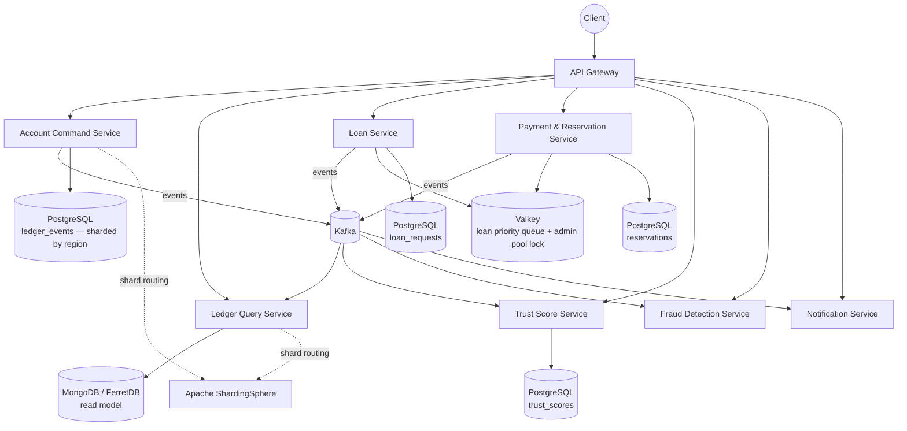

# Architecture — Event-Sourced Banking Ledger (v2)

> **Source of truth:** `HLD_LLD_SystemDesign_v2.md` (repo root). This document adapts its
> §0 tech stack, §2 topology, and the responsibilities it assigns to each service.
> v2 shifts the center of gravity from "CQRS demo app" to **concrete distributed-systems
> and distributed-database mechanisms you can point at and prove**: a contended-resource
> task queue, offline-capable payments, cross-server concurrency control, and hybrid data
> fragmentation.

---

## 1. System context

*(diagram reused from v2 §2)*

**8 services** (well above the 5-service minimum) plus shared infrastructure:

- `Apache ShardingSphere` is a **library embedded in Account Command and Ledger Query's JDBC
  layer**, not a standalone service.
- `Valkey` is **shared infrastructure**, not a business service.

## 2. Tech stack (v2 §0)

| Concern | Tool | License | Why this one |
|---|---|---|---|
| Distributed locks, fair (FCFS) locking, priority queues | **Redisson** (Java client) | Apache 2.0 | `RFairLock` gives true first-come-first-served lock acquisition (not just "a lock" — a *fair* one, which is exactly requirement 3). `RScoredSortedSet` gives an O(log n) priority queue for the loan system. |
| In-memory store backing Redisson | **Valkey** (Linux Foundation fork of Redis 7.2) | BSD-3-Clause | Redis moved to SSPL/RSAL/AGPL licensing in 2024–2025 (source-available, not OSI open source). Valkey is the community fork that stayed BSD, is wire-protocol compatible, and needs zero code changes in Redisson. Use Valkey, not Redis, as the actual running server. |
| Alternative/complementary task queue | **RabbitMQ** (native priority queues via `x-max-priority`) | MPL 2.0 | Documented as the "dedicated broker" alternative to a Redis-based queue for the loan/withdrawal task queues. Not wired into the v2 build. |
| Event streaming | **Apache Kafka** | Apache 2.0 | Partition-per-account ordering, replayable log. |
| Event store / relational data | **PostgreSQL** | PostgreSQL License | Unchanged from v1. |
| Database sharding middleware | **Apache ShardingSphere** (ShardingSphere-JDBC) | Apache 2.0 | Implements horizontal fragmentation as a JDBC-layer library — no separate proxy process; application code queries logical tables and ShardingSphere routes to the correct physical shard. |
| Read-model document store | **MongoDB Community Edition** | SSPL (⚠️ not OSI-approved) | Flagged honestly: if a fully-open-source stack matters, swap to **FerretDB** (Apache 2.0, MongoDB-wire-compatible over PostgreSQL) or use PostgreSQL `JSONB`. See `docs/OPEN_DECISIONS.md`. |
| IP → region lookup (for fragmentation) | **ip-location-db** (`sapics/ip-location-db`) | PDDL (public-domain-equivalent) | MaxMind GeoLite2 requires an account + EULA even for the free tier. `ip-location-db` ships ready-to-use CSV/MMDB country files with no signup. |
| Offline payment token signing | **Nimbus JOSE + JWT** | Apache 2.0 | Signs/verifies offline payment tokens asymmetrically — a merchant device verifies authenticity with no network call. |
| Service discovery, gateway, config | **Eureka, Spring Cloud Gateway, Spring Cloud Config** | Apache 2.0 | Unchanged from v1. |
| Resilience | **Resilience4j** | Apache 2.0 | Unchanged from v1. |
| Testing | **JUnit5, Testcontainers** (also spinning up Valkey + a second Postgres shard in CI) | EPL/MIT | Unchanged, extended. |

## 3. Service responsibility matrix

| # | Service | Module | Port | Type | Responsibilities (v2 section) |
|---|---|---|---|---|---|
| 1 | **API Gateway** | `api-gateway` | 8080 | Spring Cloud Gateway | Single entry point; Eureka discovery-based routing to all 7 backing services; forwards `Idempotency-Key` headers (§2, §6) |
| 2 | **Account Command Service** | `account-command-service` | 8081 | Command/Write side | Validates deposits, withdrawals, transfers; appends events to the region-sharded `ledger_events` store via ShardingSphere-JDBC; publishes to Kafka; consumes withdrawal commands from partition-per-account topic; guards debits with Redisson `RFairLock` (§5, §6, §7) |
| 3 | **Ledger Query Service** | `ledger-query-service` | 8082 | Query/Read side | Consumes account events into the read model (MongoDB / FerretDB); serves transaction history; reads sharded `ledger_events` via ShardingSphere-JDBC for replay & recovery (§2, §7) |
| 4 | **Loan Service** | `loan-service` | 8085 | Domain service | Enqueues loan requests into a Valkey `RScoredSortedSet` priority queue (trust tier first, arrival time second); worker runs the atomic Lua pop-and-debit of the admin pool; emits `LoanApproved`/`LoanDisbursed`/`LoanRepaid*`/`LoanDefaulted`; manages `WAITING_FOR_FUNDS` re-checks on `AdminPoolReplenished` (§3) |
| 5 | **Payment & Reservation Service** | `payment-reservation-service` | 8086 | Domain service | Online payments (synchronous call to Account Command); offline payments via pessimistic pre-commit reservations — `FundsReserved`/`FundsCaptured`/`FundsReleased` + Nimbus JOSE+JWT signed offline tokens; idempotent capture keyed by `reservationId` (§4) |
| 6 | **Trust Score Service** | `trust-score-service` | 8087 | Domain service | Consumes `account.events` and `loan.events`; maintains running 0–100 score and tier per account; publishes `TrustScoreChanged` (§3.6) |
| 7 | **Fraud Detection Service** | `fraud-detection-service` | 8083 | Event consumer | Evaluates fraud rules over account and payment events (carried over from v1; §9 step 7) |
| 8 | **Notification Service** | `notification-service` | 8084 | Event consumer | Sends customer notifications over SMTP (MailHog in dev) for domain events (carried over from v1; §9 step 7) |

Shared infrastructure (not business services): **Eureka** (`infra/eureka`, 8761), **Spring Cloud
Config Server** (`infra/config`, 8888, backed by `infra/config-repo`), **Kafka**, **Valkey**,
**PostgreSQL** (region shards), **MongoDB/FerretDB** (read model).

## 4. Requirement → mechanism map (v2 §1)

| # | Requirement | Mechanism | Section |
|---|---|---|---|
| 1 | Loan system, pool contention, FCFS + trust score | Redisson priority queue (`RScoredSortedSet`) + atomic pool debit via Lua script | §3 |
| 2 | Internet pay + offline pay via temp reservation | `FundsReserved`/`FundsCaptured`/`FundsReleased` events + signed offline token | §4 |
| 3 | Multi-server concurrent withdrawal, task queue, FCFS | Kafka partition-per-account + Redisson `RFairLock` | §5 |
| 4 | Basic concurrency verification | Optimistic concurrency (v1, retained) + idempotency keys | §6 |
| 5 | Hybrid vertical + horizontal fragmentation by IP | ShardingSphere region-based horizontal sharding + column-split vertical fragmentation | §7 |
| 6 | Open-source tooling | §0 table above | §0 |

## 5. What to build first (v2 §9)

1. Account Command + Ledger Query with the v1 event-sourcing core (foundation everything else sits on).
2. Trust Score Service (simple event consumer, needed before Loan Service can price anything).
3. Loan Service with the Valkey priority queue + Lua script (the centerpiece distributed-systems feature).
4. Redisson `RFairLock` retrofit onto the withdrawal path in Account Command Service.
5. Payment & Reservation Service (online path first, then offline token issuance/capture).
6. ShardingSphere region fragmentation (retrofitted onto Account Command/Ledger Query once the schema is stable — don't do this first, it complicates early debugging).
7. Fraud Detection + Notification (carried over from v1, lowest risk).

## 6. Related documents

- `docs/EVENT_CATALOG.md` — every event, topic, producer, consumer
- `docs/API_SPEC/` — one OpenAPI YAML per service
- `docs/SAGA_DESIGN.md` — transfer saga + loan pop-and-debit + withdrawal FCFS flows
- `docs/DATA_MODEL.md` — schemas (admin_pool, loan_requests, reservations, processed_requests, fragmented account data)
- `docs/FRAGMENTATION_DESIGN.md` — hybrid horizontal + vertical fragmentation deep dive
- `docs/TESTING_STRATEGY.md` — test pyramid incl. the three required concurrency tests
- `docs/DEPLOYMENT.md` — docker-compose topology and run order
- `docs/OPEN_DECISIONS.md` — still-open design decisions
