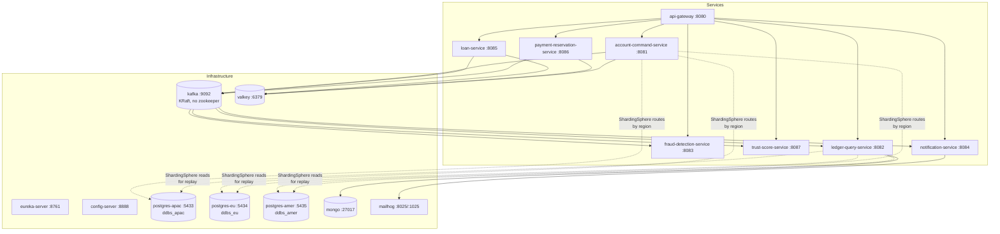

# Deployment (v2)

> **Source of truth:** `HLD_LLD_SystemDesign_v2.md`. The root `docker-compose.yml` is the
> working local demo: **Valkey** replaces Redis (license, v2 §0), Kafka runs in KRaft
> mode (no Zookeeper), and Postgres is split into **3 region shards** — enough to prove
> the fragmentation concept, deliberately not exhaustive (v2 §7). MongoDB is kept with
> **FerretDB** noted as the OSI-clean swap (see `docs/OPEN_DECISIONS.md`).

---

## 1. Topology



## 2. Container inventory

| Container | Image | Host port | Purpose |
|---|---|---|---|
| `eureka-server` | `ddbs-eureka-server:0.2.0` | 8761 | Service discovery |
| `config-server` | `ddbs-config-server:0.2.0` | 8888 | Spring Cloud Config (mounts `./infra/config-repo`) |
| `valkey` | `valkey/valkey:8.1` | 6379 | Redisson backend: `loan:queue` RScoredSortedSet, `admin_pool:balance` Lua debit, `RFairLock` per account |
| `kafka` | `bitnami/kafka:3.7` (KRaft) | 9092 | Event streaming + partition-per-account command ordering |
| `postgres-apac` | `postgres:16-alpine` | 5433 | Shard `ds_apac` (db `ddbs_apac`) |
| `postgres-eu` | `postgres:16-alpine` | 5434 | Shard `ds_eu` (db `ddbs_eu`) |
| `postgres-amer` | `postgres:16-alpine` | 5435 | Shard `ds_amer` (db `ddbs_amer`) |
| `mongo` | `mongo:7.0` | 27017 | Read model (FerretDB drop-in if chosen) |
| `mailhog` | `mailhog/mailhog` | 8025 / 1025 | Fake SMTP UI for notifications |
| 8 service containers | `ddbs-*:0.2.0` | 8080–8087 | See `docs/ARCHITECTURE.md` §3 |

## 3. Run order

```bash
# build everything first (services + the two infra modules)
./mvnw -DskipTests package

# start infrastructure, then services (compose handles depends_on ordering)
docker compose up -d

# watch service registration
open http://localhost:8761          # Eureka dashboard
open http://localhost:8025          # MailHog UI (notifications)
```

`depends_on` ordering in the compose file is startup order only — services additionally
tolerate the broker/stores being briefly unavailable at boot (scaffolding note: wiring
readiness probes is implementation-stage work).

## 4. Sharding bootstrap (manual, implementation stage)

The three shard databases start empty. When the fragmentation retrofit lands (v2 §9
step 6), a bootstrap script creates the vertical-split schema
(`account_core`, `account_pii`, `ledger_events`) on **each** shard and seeds
ShardingSphere's datasource map (`ds_apac`, `ds_eu`, `ds_amer`). Until then the services
point at a single default shard URL so early debugging stays simple (v2 §9 step 6:
"don't do this first, it complicates early debugging").

## 5. Environment variables (per service)

| Variable | Consumed by | Meaning |
|---|---|---|
| `SPRING_KAFKA_BOOTSTRAP_SERVERS` | all | Kafka bootstrap (container-internal `kafka:9092`) |
| `SPRING_DATASOURCE_URL` / `_USERNAME` / `_PASSWORD` | data-owning services | Default shard JDBC URL (ShardingSphere overrides routing per region once enabled) |
| `SPRING_DATA_REDIS_HOST`, `REDISSON_ADDRESS` | account-command, loan, payment-reservation | Valkey location for Redisson |
| `SPRING_DATA_MONGODB_URI` | ledger-query | Read-model store (swap host to `ferretdb:27017` with zero code change) |
| `SPRING_MAIL_HOST`, `SPRING_MAIL_PORT` | notification | MailHog SMTP |
| `EUREKA_CLIENT_SERVICE_URL_DEFAULTZONE` | all | Discovery |

## 6. Local demo scenario (once implemented)

1. Open accounts with distinct registration IPs → rows land in different shards.
2. Seed `admin_pool` = ₹2,000; fire two ₹2,000 loan requests → one `DISBURSED`, one
   `WAITING_FOR_FUNDS` (`docs/TESTING_STRATEGY.md` §3.1).
3. Reserve ₹500 offline, scan the token twice → first capture wins, second rejected
   (`docs/TESTING_STRATEGY.md` §3.3).
4. Two simultaneous withdrawals → FCFS ordering at the broker + fair lock
   (`docs/TESTING_STRATEGY.md` §3.2).

## 7. CI

Testcontainers spins up **Valkey** and **a second Postgres shard** in CI (v2 §0) so the
concurrency tests in `docs/TESTING_STRATEGY.md` run against real infrastructure.
