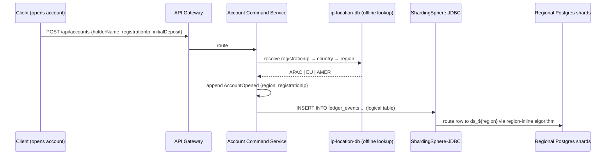
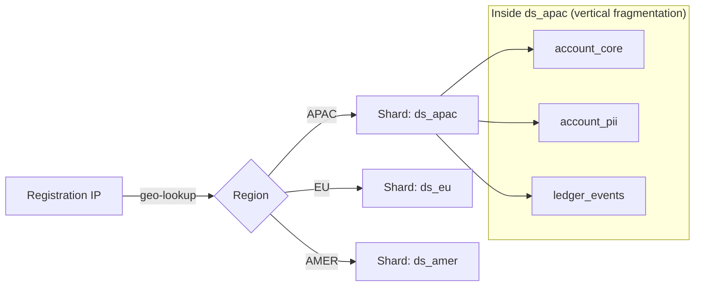

# Fragmentation Design — Hybrid Horizontal + Vertical, by Registration IP (v2 §7)

> **Source of truth:** `HLD_LLD_SystemDesign_v2.md` §7. This document is the dedicated
> deep dive on the hybrid fragmentation requirement: how a customer's registration IP
> determines *where* their rows live (horizontal), and why their data is additionally
> *split by column* inside that shard (vertical).

---

## 1. Why hybrid

Most student DDBS projects implement only one fragmentation axis. This project implements
both, with **independent reasons for each** (v2 §7.3):

- **Horizontal (row-splitting) by region** — *data locality / latency*: a customer's rows
  live in the shard closest to where they registered; the sharding key is derived from
  their registration IP.
- **Vertical (column-splitting) within each shard** — *sensitivity / access pattern*: hot
  small columns, sensitive PII, and the high-volume append-only event log have different
  I/O and security profiles, so they are physically separated.

A single customer's data is therefore: **horizontally** placed into one regional shard
(say `ds_apac`) based on their registration IP, and **vertically** split within that
shard across `account_core` / `account_pii` / `ledger_events`.

## 2. Horizontal fragmentation (row-splitting, by region) — v2 §7.1

At account-open time, the customer's registration IP is resolved to a region using the
**ip-location-db** dataset (offline CSV/MMDB lookup — no external call at request time;
chosen over MaxMind GeoLite2 because it needs no account/EULA). The resolved `region`
(e.g., `APAC`, `EU`, `AMER`) is stored on the account and used as the **sharding key**.

### Region-resolution flow



Region is snapshotted at account-open time and never re-resolved: an account's rows do
not migrate between shards when the customer travels — the shard key must be stable for
fragmentation transparency to hold.

### ShardingSphere-JDBC configuration

ShardingSphere is a **library embedded in Account Command and Ledger Query's JDBC layer**,
not a standalone service (v2 §2). The rule config (v2 §7.1):

```yaml
rules:
  - !SHARDING
    tables:
      ledger_events:
        actualDataNodes: ds_${region}.ledger_events
        databaseStrategy:
          standard:
            shardingColumn: region
            shardingAlgorithmName: region-inline
    shardingAlgorithms:
      region-inline:
        type: INLINE
        props:
          algorithm-expression: ds_${region}
```

Application code still writes `INSERT INTO ledger_events ...` against a *logical* table;
ShardingSphere transparently routes each row to `ds_apac`, `ds_eu`, or `ds_amer`. This
transparency — app code doesn't know or care which physical database it hit — is itself a
core DDBS concept worth naming explicitly: **fragmentation transparency** (v2 §7.1).

Physical shards:

| Datasource | Contents |
|---|---|
| `ds_apac` | rows whose `region = 'APAC'` |
| `ds_eu` | rows whose `region = 'EU'` |
| `ds_amer` | rows whose `region = 'AMER'` |

## 3. Vertical fragmentation (column-splitting, within each shard) — v2 §7.2

Within each regional shard, account data is split by access pattern and sensitivity,
rather than kept as one wide table:

| Fragment | Contents | Why split out |
|---|---|---|
| `account_core` | accountId, status, region, openedAt | Small, hot, read on almost every request |
| `account_pii` | holderName, KYC documents, registration IP, address | Sensitive, infrequently read, candidate for stricter access control/encryption at rest |
| `ledger_events` | the append-only event log itself | Extremely high write volume, never updated — benefits from being physically isolated from the slower-changing tables above so its I/O pattern doesn't contend with them |

The three splits have three different justifications: hot-vs-cold reads (`account_core`),
sensitivity (`account_pii`), and write-volume I/O isolation (`ledger_events`) — the
column-split axis is not just "one more cut" of the region axis.

## 4. Combined picture — v2 §7.4



*(diagram from v2 §7.4; `ds_eu` and `ds_amer` have the same internal vertical split)*

## 5. What is *not* fragmented

| Data | Owner | Why single-DB |
|---|---|---|
| `admin_pool`, `loan_requests` | Loan Service | Single operational pool + queue state; contention is handled by the Valkey Lua script, not by sharding |
| `reservations` | Payment & Reservation Service | Idempotent capture keyed by `reservationId` needs one authoritative row |
| `processed_requests` | each state-changing service | Idempotency keys are global by design (v2 §6) |
| `trust_scores` | Trust Score Service | One row per account, tiny |
| Read model | Ledger Query Service | Projection, rebuildable from `ledger_events` |

## 6. Consequences & trade-offs

- **Cross-region queries are not free.** A query spanning all regions (e.g., admin
  reporting) must fan out to every shard and merge — the price of data locality. The
  read model (MongoDB/FerretDB) absorbs most read traffic precisely so that cross-shard
  reads are rare.
- **Rebalancing is out of scope.** Region → shard mapping is static in v2; moving an
  account between regions would require re-resolving and copying rows, which we
  deliberately avoid by freezing `region` at account-open time.
- **ShardingSphere-JDBC keeps the app simple.** No proxy process to run; the routing
  happens inside the same JVM. The cost is that every service touching `ledger_events`
  needs the library on its classpath (Account Command and Ledger Query in v2 §2).
- **Kafka is not sharded by region.** Event *streaming* is partitioned by `accountId`
  for ordering (v2 §5); event *storage* is fragmented by `region` for locality. The two
  axes are independent and both are intentional.
