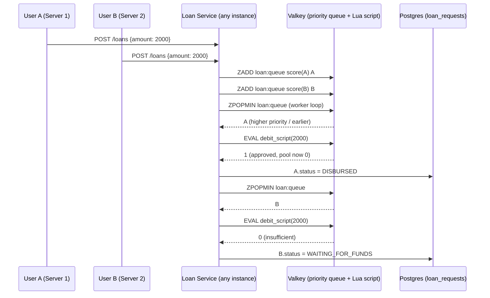
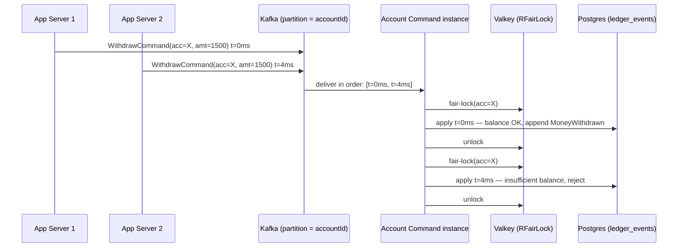

# Distributed Coordination Flows (v2)

> **Source of truth:** `HLD_LLD_SystemDesign_v2.md`. This document keeps the v1 transfer
> saga and adds the two other distributed coordination flows v2 introduces: the **loan
> pop-and-debit flow** (v2 §3.5) and the **withdrawal FCFS flow** (v2 §5.3). Only the
> transfer flow is a formal saga (orchestrated compensation); the other two are
> distributed concurrency-control flows included here because coordination across
> servers/brokers is what they are about.

---

## 1. Money transfer saga (orchestration, carried over from v1)

**Pattern:** orchestrated saga. The Account Command Service acts as saga orchestrator.
The source debit and target credit are separate local transactions, each appending events
to the region-sharded `ledger_events` store; a failure after the source leg triggers the
compensation event `TransferSourceReimbursed`.

**Normal path:**
1. `POST /api/transfers` → `TransferCommand` published to `account.commands` (keyed by `fromAccountId`).
2. `TransferInitiated` appended.
3. Source leg: validate balance (under `RFairLock("account-lock:" + fromAccountId)`), append `MoneyWithdrawn` + `TransferSourceDebited`.
4. Target leg: append `MoneyDeposited` + `TransferTargetCredited`.
5. `TransferCompleted` appended. Saga done.

**Compensation path:** if the target leg fails (account closed, invalid target), append
`TransferFailed` + `TransferSourceReimbursed` (money returned to source). Because every
step is an event, the compensation itself is just more events — no deletions, ever.

## 2. Loan pop-and-debit flow (v2 §3.5) — new

**Pattern:** priority queue + atomic check-and-debit (Lua). Not a saga — the two "legs"
(read pool balance, debit it) are fused into a single atomic operation on Valkey, so no
compensation is ever needed. The failure mode this kills: two servers both reading
"₹2,000 available" and both approving (read and debit as separate steps).



*(diagram from v2 §3.5)*

- Queue score: `(3 - trustTier) * 10_000_000_000L + requestedAtEpochMillis` — tier first, FCFS within tier (v2 §3.3).
- Debit script (v2 §3.4):

```lua
-- KEYS[1] = admin_pool:balance, ARGV[1] = requested amount
local bal = tonumber(redis.call('GET', KEYS[1]))
if bal >= tonumber(ARGV[1]) then
  redis.call('DECRBY', KEYS[1], ARGV[1])
  return 1   -- approved
else
  return 0   -- insufficient funds right now
end
```

- Success → `LoanApproved` → `LoanDisbursed`, `loan_requests.status = DISBURSED`.
- Failure → `status = WAITING_FOR_FUNDS`; stays out of the active queue until
  `AdminPoolReplenished` triggers a re-check of the waiting list, highest-priority first.
- Exactly the ₹2,000-pool / two-₹2,000-requests scenario: the first request to reach the
  front of the queue (by tier, then FCFS) gets the money; the second is queued, not
  rejected outright and not double-approved.

## 3. Withdrawal FCFS flow (v2 §5.3) — new

**Pattern:** broker-side ordering + fair lock. Two layers of defense (v2 §5.2):

- **Layer 1 — ordering at the queue, not the app server.** Withdrawal *commands* are
  published to Kafka keyed by `accountId`; only one partition holds all messages for a
  key and only one consumer instance processes a partition at a time. FCFS ordering
  happens at the broker, not by trusting whichever app server happened to run first.
- **Layer 2 — a fair lock around the actual debit.** The consuming instance acquires
  Redisson `RFairLock("account-lock:" + accountId)` before reading version/balance and
  writing the event. `RFairLock` avoids the "barging" problem of a plain lock — a thread
  that arrives later cannot acquire the lock before one that's been waiting longer,
  which matters because "first come, first served" is a stated requirement.



*(diagram from v2 §5.3)*

The `UNIQUE(aggregate_id, version)` optimistic-concurrency constraint on the event store
remains the ultimate correctness guard underneath both layers (v2 §6).

## 4. Why only one of these is a saga

| Flow | Coordination style | Why |
|---|---|---|
| Transfer | Saga (orchestrated, compensatable legs) | Two independent local transactions on two accounts; failure after leg 1 needs compensation |
| Loan approval | Atomic check-and-debit (Lua) on Valkey | Legs fused into one atomic op; no window for partial failure, so no compensation to do |
| Withdrawal FCFS | Broker ordering + fair lock | Single aggregate, single local transaction; the problem is *ordering under concurrency*, not multi-step compensation |

The offline-payment path is the inverse design choice: it cannot even wait for
coordination, so it *pessimistically reserves before* the risk window — see
`docs/EVENT_CATALOG.md` §4 and v2 §4.4.
