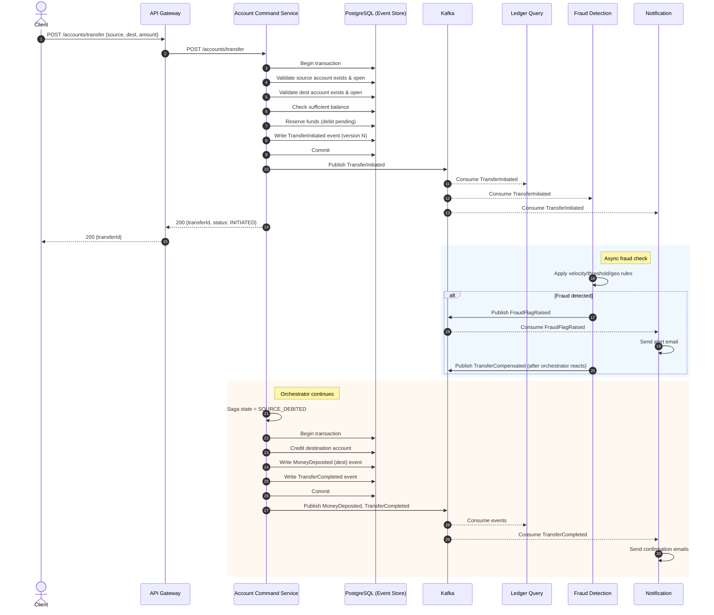
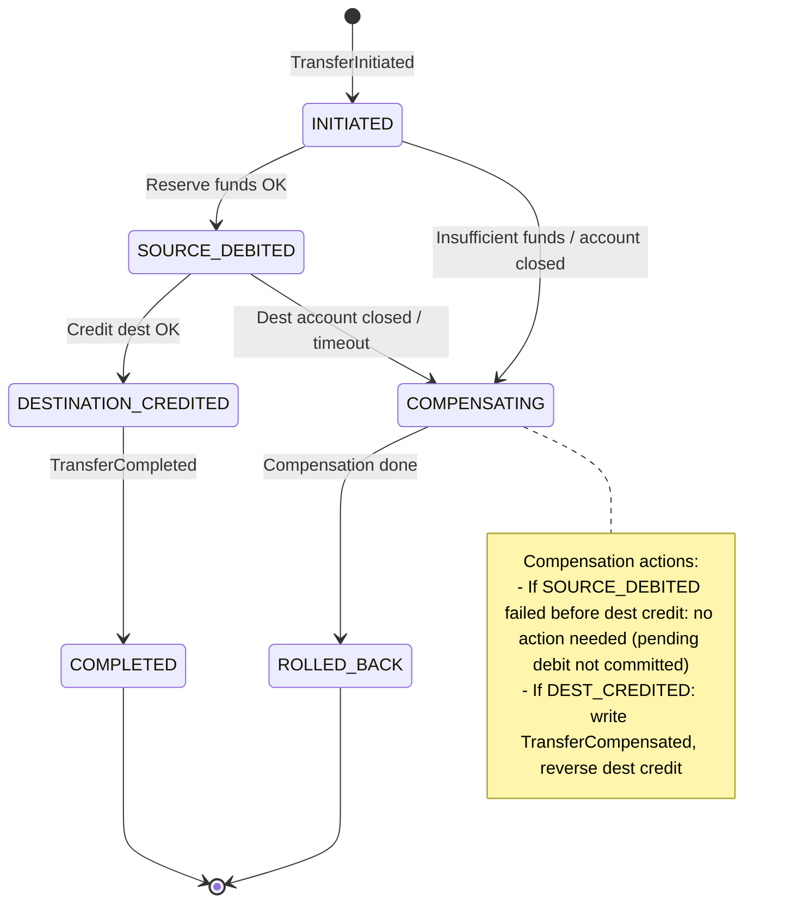

# Saga Design — Money Transfer

## Overview

The money transfer between two accounts is the primary cross-service consistency scenario. We use **orchestration-based saga** inside the Account Command Service.

## Transfer Saga Steps



## Saga State Machine



## Saga State Persistence

The saga state is persisted in the **same PostgreSQL transaction** as the events:

```sql
CREATE TABLE saga_transfers (
    transfer_id     UUID PRIMARY KEY,
    source_account  UUID NOT NULL,
    dest_account    UUID NOT NULL,
    amount          NUMERIC(19,2) NOT NULL,
    currency        VARCHAR(3) NOT NULL,
    state           VARCHAR(20) NOT NULL,
    current_step    INTEGER NOT NULL DEFAULT 0,
    created_at      TIMESTAMPTZ NOT NULL DEFAULT now(),
    updated_at      TIMESTAMPTZ NOT NULL DEFAULT now(),
    version         BIGINT NOT NULL DEFAULT 0  -- optimistic locking
);
```

**Optimistic concurrency:** Each saga state update increments `version` and checks expected version — prevents double-processing on retries.

## Compensating Actions

| Failure Point | Compensation |
|---|---|
| Source account closed / insufficient funds before reserve | No compensation needed — `TransferFailed` event emitted |
| Destination account closed after source reserved | Emit `TransferCompensated`, reverse pending debit on source |
| Fraud flag raised after source reserved | Emit `TransferCompensated`, reverse pending debit, alert |
| Destination credit fails (DB error) | Retry with exponential backoff; after max retries, compensate |
| Timeout waiting for async step | Saga orchestrator timeout handler triggers compensation |

## Timeout & Retry Handling

- **Step timeout**: 30 seconds per step (configurable).
- **Retry policy**: Exponential backoff (1s, 2s, 4s, 8s) — max 3 retries per step.
- **Dead letter**: After max retries, saga moves to `COMPENSATING` state and alerts operations.
- **Idempotency**: All saga steps are idempotent — repeating a step with same `transferId` and `currentStep` is a no-op.

## Event Replay & Recovery

On service restart, the Account Command Service can rebuild saga states by reading all `TransferInitiated` events and replaying the state machine. Incomplete sagas (state ≠ COMPLETED/ROLLED_BACK) are picked up by a background recovery job that continues from the last persisted step.